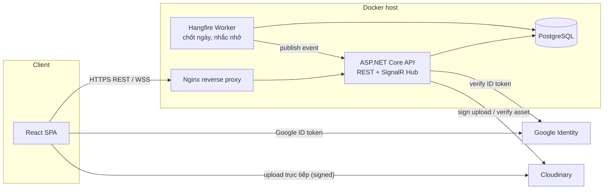
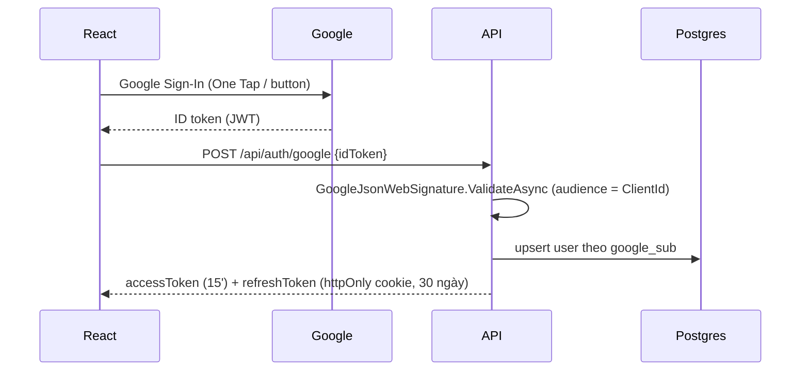
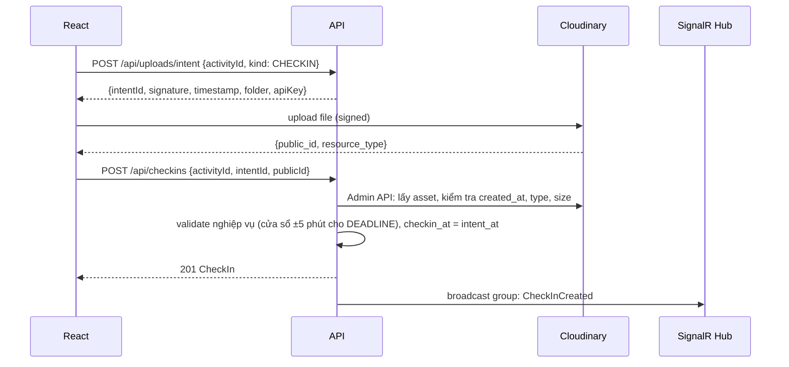
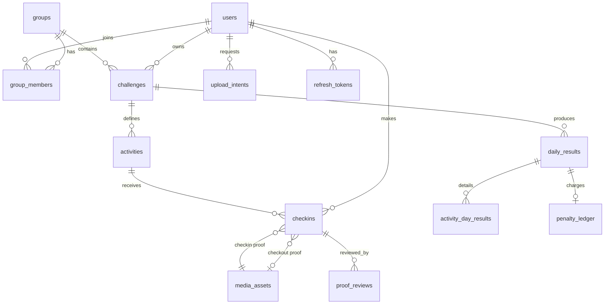

# Habit Check-in — Tài liệu thiết kế hệ thống

> Web todo list theo ngày, check-in có bằng chứng (ảnh/video), tính tiền phạt tự động, theo dõi realtime từng người trong nhóm.

| Thành phần  | Công nghệ                                                  |
| ----------- | ---------------------------------------------------------- |
| Frontend    | React 18 + TypeScript + Vite                               |
| Backend     | ASP.NET Core (.NET 10 LTS, hoặc .NET 8) Web API + SignalR  |
| Database    | PostgreSQL 16                                              |
| Đăng nhập   | Google Sign-In (Gmail) → JWT nội bộ                        |
| Lưu media   | Cloudinary (upload trực tiếp từ client bằng chữ ký server) |
| Job định kỳ | Hangfire (storage Postgres)                                |
| Triển khai  | Docker Compose + Nginx                                     |

---

## 1. Giả định & quy tắc nghiệp vụ

### 1.1 Khái niệm chính

- **User**: đăng nhập bằng Gmail, có avatar, tên hiển thị.
- **Group (Nhóm)**: tập hợp người chơi cùng nhau, xem realtime trạng thái của nhau, dùng chung một quỹ phạt. Tham gia bằng mã mời. User có thể **tạo/tham gia nhiều nhóm** và tự do chuyển đổi — thanh bar trái hiển thị danh sách nhóm kèm **số việc chưa làm hôm nay** của từng nhóm (badge số cam; ✓ xanh khi xong hết), click nhóm để chuyển nhóm đang theo dõi (mọi trang theo group này); **không có chức năng xoá nhóm**.
- **Challenge (Kỳ thử thách)**: mỗi user trong một nhóm tạo 1 challenge có `start_date` và `end_date`. Trong challenge user tự định nghĩa danh sách hoạt động.
- **Activity (Hoạt động)**: do user tự điền tên + kiểu thời gian + thông số.
- **Check-in**: lần ghi nhận thực hiện hoạt động, **bắt buộc đính kèm ảnh hoặc video**.
- **Daily Result**: kết quả chốt mỗi ngày của từng user: số hoạt động fail và số tiền phạt.

### 1.2 Kiểu thời gian của hoạt động

| Kiểu                             | Ý nghĩa                                                                          | Tham số                                                            | Điều kiện PASS                                                         |
| -------------------------------- | -------------------------------------------------------------------------------- | ------------------------------------------------------------------ | ---------------------------------------------------------------------- |
| `DEADLINE` (mốc giờ)             | Phải check-in đúng một giờ nhất định. VD: Dậy sớm trước 06:00                    | `deadline_time` (HH:mm) — chỉ nhận **±5 phút** quanh mốc (cố định) | Có check-in trong khoảng `[deadline_time − 5, deadline_time + 5]` phút |
| `DURATION` (thời lượng)          | Hoạt động kéo dài một số phút, tick + chụp 1 ảnh khi làm xong. VD: Thể dục 1 giờ | `target_minutes` (thời lượng mô tả, VD 60 = 1 giờ)                 | Có ≥ 1 check-in hợp lệ trong ngày (tick + bằng chứng)                  |
| `WINDOW` (khung giờ) _(mở rộng)_ | Phải check-in trong khung giờ. VD: Uống nước 12:00–13:00                         | `window_start`, `window_end`                                       | Có check-in trong khung                                                |

### 1.3 Bằng chứng (proof)

- Mỗi check-in **bắt buộc** 1 media: ảnh hoặc video. (DURATION cũng chỉ check-in 1 lần/ngày — tick + 1 ảnh, không còn check-in/check-out đo thời lượng.)
- Hoạt động có thể cấu hình `proof_type`: `PHOTO` | `VIDEO` | `ANY`.
- Giới hạn: ảnh ≤ 10MB, video ≤ 60s / 50MB (cấu hình được).
- Chống gian lận:
  - Giờ check-in lấy theo **giờ server**, không tin giờ client.
  - Luồng: client xin _upload intent_ → server ghi `intent_at` và trả chữ ký Cloudinary → client upload → gửi `public_id` lên check-in. `checkin_at = intent_at`, với điều kiện media hoàn tất upload trong vòng 15 phút sau intent (kiểm bằng `created_at` từ Cloudinary Admin API). Nhờ vậy video upload chậm không bị tính trễ oan.
  - Trên mobile, input dùng `capture="environment"` để ưu tiên chụp trực tiếp từ camera.
  - Mỗi `public_id` chỉ dùng một lần.
  - **Không có bước duyệt**: bằng chứng hợp lệ ngay khi upload thành công (các endpoint report/approve/reject vẫn giữ trong code, UI không dùng).

### 1.4 Quy tắc tính phạt

Mỗi ngày, đếm số hoạt động **FAIL** (không check-in, hoặc check-in ngoài khung ±5 phút của DEADLINE):

| Số hoạt động fail trong ngày | Tiền phạt                   |
| ---------------------------- | --------------------------- |
| 0                            | 0đ                          |
| 1                            | 20.000đ                     |
| 2                            | 50.000đ                     |
| 3                            | 70.000đ                     |
| > 3                          | 70.000đ + 20.000đ × (n − 3) |

- Bảng bậc phạt lưu dạng cấu hình (`penalty_tiers` JSONB) theo **nhóm**, chủ nhóm chỉnh được trước khi các challenge bắt đầu.
- **Không có phạt riêng theo hoạt động**: mọi hoạt động fail đều đếm chung vào bảng bậc trên. (Yêu cầu gốc "Dậy sớm trễ phạt 10k" đã chốt bỏ — chỉ dùng bảng bậc nhóm; `override_penalty` đã xoá khỏi code + DB.)
- **Cheat day (1/tuần)**: mỗi user tự đánh dấu **1 ngày cheat/tuần (T2–CN, giờ VN)** cho **từng nhóm** (quỹ phạt tính theo nhóm). Đánh dấu được **bất kỳ lúc nào** cho **hôm nay → +7 ngày** (mặc định hôm nay, không lùi quá khứ); **huỷ được trong chính hôm đó** (trước khi chốt ngày). Ngày cheat: không cần check-in, không tính phạt — settlement ghi `daily_result` với 0 fail / 0 phạt, cờ `is_cheat_day = true`, không ghi chi tiết từng hoạt động; bảng live hiện trạng thái trung lập + huy hiệu "🎉 Cheat day".

### 1.5 Khoá hoạt động theo ngày bắt đầu

- Challenge có trạng thái: `DRAFT` → `ACTIVE` → `COMPLETED` (hoặc `CANCELLED` khi còn DRAFT).
- Khi `DRAFT` (hôm nay < `start_date`): thêm/sửa/xoá hoạt động thoải mái, sửa ngày bắt đầu/kết thúc.
- Từ 00:00 ngày `start_date` (giờ `Asia/Ho_Chi_Minh`): chuyển `ACTIVE`, **khoá toàn bộ hoạt động** (không thêm/sửa/xoá, không đổi ngày). Server chặn ở tầng Application và có thêm trigger DB làm lớp bảo vệ thứ hai.
- Sau `end_date` và chốt ngày cuối → `COMPLETED`.
- Một user chỉ có tối đa 1 challenge `ACTIVE` trong một nhóm tại một thời điểm, các challenge không được chồng ngày.

### 1.6 Chốt ngày (settlement)

- Múi giờ cố định: `Asia/Ho_Chi_Minh`.
- **00:05 hằng ngày**: job tính kết quả _tạm thời_ (`PROVISIONAL`) cho ngày hôm trước.
  - Phiên `DURATION` OPEN cũ (tạo trước thay đổi tick + 1 ảnh) chưa check-out đến 23:59:59 → tự đóng, **không tính** (trạng thái `ABANDONED`). Từ nay DURATION không tạo phiên OPEN.
- **12:00 hằng ngày**: job chốt `FINAL`, ghi tiền phạt vào sổ quỹ (ledger).
- Không có cửa sổ khiếu nại / duyệt: bằng chứng hợp lệ ngay khi upload (xem §1.3), nên kết quả `PROVISIONAL` cơ bản đã ổn định đến lúc chốt `FINAL`.

---

## 2. Kiến trúc tổng thể



- API và Hangfire có thể chạy chung 1 process (đơn giản) hoặc tách service worker khi scale.
- Scale nhiều instance API: bật **SignalR Redis backplane** (thêm Redis vào compose).

### 2.1 Luồng đăng nhập Google



### 2.2 Luồng check-in có bằng chứng



---

## 3. Cấu trúc code base

### 3.1 Monorepo

```
habit-checkin/
├── apps/
│   ├── web/                      # React
│   └── api/                      # .NET solution
├── deploy/
│   ├── docker-compose.yml
│   ├── nginx/default.conf
│   └── .env.example
├── docs/
│   └── habit-checkin-design.md
└── .github/workflows/ci.yml
```

### 3.2 Backend — Clean Architecture

```
apps/api/
├── HabitCheckin.sln
├── src/
│   ├── HabitCheckin.Domain/            # Entity, Value Object, enum, rule thuần
│   │   ├── Entities/ (User, Group, GroupMember, Challenge, Activity, CheckIn,
│   │   │             MediaAsset, DailyResult, ActivityDayResult, ProofReview,
│   │   │             PenaltyLedgerEntry, UploadIntent)
│   │   ├── Enums/    (ActivityType, ProofType, ChallengeStatus, CheckInStatus, ...)
│   │   └── Services/ (PenaltyCalculator, ActivityEvaluator)   # không phụ thuộc hạ tầng
│   ├── HabitCheckin.Application/       # Use case (CQRS với MediatR), DTO, validator
│   │   ├── Abstractions/ (IAppDbContext, IClock, IMediaStorage, IRealtimeNotifier, ICurrentUser)
│   │   ├── Auth/         (GoogleLoginCommand, RefreshTokenCommand)
│   │   ├── Groups/       (CreateGroup, JoinGroup, GetGroupLiveBoard, UpdatePenaltyTiers)
│   │   ├── Challenges/   (CreateChallenge, UpdateChallenge, AddActivity, ...)
│   │   ├── CheckIns/     (CreateUploadIntent, CheckIn, CheckOut, GetToday)
│   │   ├── Reviews/      (ReportProof, RejectProof, ApproveProof)
│   │   ├── Stats/        (GetUserStats, GetGroupLeaderboard, GetCalendarHeatmap)
│   │   ├── Settlement/   (SettleDayCommand, FinalizeDayCommand)
│   │   └── Profile/      (UpdateProfile, UpdateAvatar)
│   ├── HabitCheckin.Infrastructure/    # EF Core, Cloudinary, Google, Hangfire, JWT
│   │   ├── Persistence/  (AppDbContext, Configurations/, Migrations/, Interceptors/)
│   │   ├── Media/        (CloudinaryMediaStorage)
│   │   ├── Auth/         (GoogleTokenValidator, JwtTokenService)
│   │   ├── Jobs/         (DailySettlementJob, FinalizeJob, ReminderJob, ChallengeActivationJob)
│   │   └── Time/         (VietnamClock : IClock)
│   └── HabitCheckin.Api/               # Controller mỏng, SignalR Hub, middleware
│       ├── Controllers/
│       ├── Hubs/ (LiveHub, SignalRNotifier : IRealtimeNotifier)
│       ├── Middleware/ (ExceptionHandling → ProblemDetails)
│       └── Program.cs
└── tests/
    ├── HabitCheckin.Domain.Tests/       # test PenaltyCalculator, ActivityEvaluator
    ├── HabitCheckin.Application.Tests/
    └── HabitCheckin.Api.IntegrationTests/  # Testcontainers PostgreSQL
```

**Package chính**: `Npgsql.EntityFrameworkCore.PostgreSQL`, `MediatR`, `FluentValidation`, `Google.Apis.Auth`, `CloudinaryDotNet`, `Hangfire.AspNetCore`, `Hangfire.PostgreSql`, `Microsoft.AspNetCore.Authentication.JwtBearer`, `Serilog.AspNetCore`, `NodaTime` (tuỳ chọn, xử lý múi giờ/ngày sạch hơn).

### 3.3 Frontend

```
apps/web/
├── src/
│   ├── app/            # router, providers (QueryClient, GoogleOAuthProvider, SignalR)
│   ├── api/            # axios instance + interceptor refresh token, client theo module
│   ├── realtime/       # signalr connection, hooks useLiveEvents
│   ├── features/
│   │   ├── auth/
│   │   ├── today/          # trang Hôm nay, nút check-in/out, đồng hồ đếm
│   │   ├── challenge/      # tạo/sửa kỳ thử thách + hoạt động
│   │   ├── live-board/     # bảng realtime nhóm
│   │   ├── review/         # trang bằng chứng check-in (chỉ đọc)
│   │   ├── stats/          # thống kê, biểu đồ
│   │   ├── fund/           # quỹ phạt
│   │   ├── group/          # nhóm, thành viên, mã mời, cấu hình phạt
│   │   └── profile/        # avatar, tên, cài đặt thông báo
│   ├── components/     # UI dùng chung (shadcn/ui)
│   ├── lib/            # format tiền VND, dayjs tz, cloudinary upload
│   └── types/          # type sinh từ OpenAPI (openapi-typescript)
├── index.html
└── vite.config.ts
```

**Thư viện**: `react-router`, `@tanstack/react-query`, `zustand` (state nhẹ: user, group đang chọn), `@react-oauth/google`, `@microsoft/signalr`, `axios`, `react-hook-form` + `zod`, `tailwindcss` + `shadcn/ui`, `recharts`, `dayjs` (+ plugin utc/timezone), `browser-image-compression` (nén ảnh trước khi upload).

---

## 4. Cơ sở dữ liệu

### 4.1 ERD



### 4.2 Bảng

```sql
-- Kiểu enum
CREATE TYPE activity_type    AS ENUM ('DEADLINE','DURATION','WINDOW');
CREATE TYPE proof_type       AS ENUM ('PHOTO','VIDEO','ANY');
CREATE TYPE challenge_status AS ENUM ('DRAFT','ACTIVE','COMPLETED','CANCELLED');
CREATE TYPE checkin_status   AS ENUM ('OPEN','COMPLETED','ABANDONED','REJECTED');
CREATE TYPE result_status    AS ENUM ('PROVISIONAL','FINAL');
CREATE TYPE member_role      AS ENUM ('OWNER','ADMIN','MEMBER');

CREATE TABLE users (
  id            uuid PRIMARY KEY DEFAULT gen_random_uuid(),
  google_sub    text UNIQUE NOT NULL,        -- user Google: "sub…"; tài khoản mật khẩu: "local:{username}"
  email         citext UNIQUE NOT NULL,
  display_name  text NOT NULL,
  username      varchar(64) UNIQUE,          -- tài khoản mật khẩu (admin); NULL với user Google
  password_hash varchar(512),                -- "PBKDF2-SHA256$<iter>$<saltB64>$<hashB64>"
  is_admin      boolean NOT NULL DEFAULT false,
  is_banned     boolean NOT NULL DEFAULT false, -- admin chặn: mọi request có auth → 403, không refresh token
  avatar_public_id text,
  avatar_url    text,
  created_at    timestamptz NOT NULL DEFAULT now(),
  last_login_at timestamptz
);

CREATE TABLE groups (
  id             uuid PRIMARY KEY DEFAULT gen_random_uuid(),
  name           text NOT NULL,
  invite_code    text UNIQUE NOT NULL,
  owner_id       uuid NOT NULL REFERENCES users(id),
  penalty_tiers  jsonb NOT NULL DEFAULT '{"tiers":[0,20000,50000,70000],"extraPerActivity":20000}',
  review_window_hours int NOT NULL DEFAULT 12,
  created_at     timestamptz NOT NULL DEFAULT now()
);

CREATE TABLE group_members (
  group_id  uuid REFERENCES groups(id) ON DELETE CASCADE,
  user_id   uuid REFERENCES users(id)  ON DELETE CASCADE,
  role      member_role NOT NULL DEFAULT 'MEMBER',
  joined_at timestamptz NOT NULL DEFAULT now(),
  PRIMARY KEY (group_id, user_id)
);

CREATE TABLE challenges (
  id          uuid PRIMARY KEY DEFAULT gen_random_uuid(),
  group_id    uuid NOT NULL REFERENCES groups(id),
  user_id     uuid NOT NULL REFERENCES users(id),
  title       text NOT NULL,
  start_date  date NOT NULL,
  end_date    date NOT NULL,
  status      challenge_status NOT NULL DEFAULT 'DRAFT',
  locked_at   timestamptz,
  created_at  timestamptz NOT NULL DEFAULT now(),
  CHECK (end_date >= start_date)
);
-- Không cho 2 challenge chồng ngày của cùng user trong cùng group
CREATE EXTENSION IF NOT EXISTS btree_gist;
ALTER TABLE challenges ADD CONSTRAINT no_overlap
  EXCLUDE USING gist (group_id WITH =, user_id WITH =,
                      daterange(start_date, end_date, '[]') WITH &&)
  WHERE (status <> 'CANCELLED');

CREATE TABLE activities (
  id                  uuid PRIMARY KEY DEFAULT gen_random_uuid(),
  challenge_id        uuid NOT NULL REFERENCES challenges(id) ON DELETE CASCADE,
  name                text NOT NULL,
  description         text,
  icon                text,
  type                activity_type NOT NULL,
  deadline_time       time,          -- DEADLINE
  grace_minutes       int NOT NULL DEFAULT 0,   -- không còn dùng (quy tắc ±5 phút cố định), giữ cột DB
  target_minutes      int,           -- DURATION (chỉ mô tả thời lượng, không dùng để chấm điểm)
  min_session_minutes int,           -- không còn dùng (không còn đo thời lượng)
  window_start        time,          -- WINDOW
  window_end          time,
  proof_type          proof_type NOT NULL DEFAULT 'ANY',
  sort_order          int NOT NULL DEFAULT 0,
  CHECK (
    (type = 'DEADLINE' AND deadline_time IS NOT NULL) OR
    (type = 'DURATION' AND target_minutes > 0) OR
    (type = 'WINDOW'   AND window_start IS NOT NULL AND window_end > window_start)
  )
);

CREATE TABLE media_assets (
  id             uuid PRIMARY KEY DEFAULT gen_random_uuid(),
  user_id        uuid NOT NULL REFERENCES users(id),
  public_id      text UNIQUE NOT NULL,
  resource_type  text NOT NULL,        -- image | video
  secure_url     text NOT NULL,
  thumbnail_url  text,
  bytes          bigint,
  duration_sec   numeric,
  uploaded_at    timestamptz NOT NULL  -- created_at từ Cloudinary
);

CREATE TABLE upload_intents (
  id          uuid PRIMARY KEY DEFAULT gen_random_uuid(),
  user_id     uuid NOT NULL REFERENCES users(id),
  activity_id uuid REFERENCES activities(id),
  kind        text NOT NULL,           -- CHECKIN | CHECKOUT | AVATAR
  intent_at   timestamptz NOT NULL DEFAULT now(),
  expires_at  timestamptz NOT NULL,
  used_at     timestamptz
);

CREATE TABLE checkins (
  id                 uuid PRIMARY KEY DEFAULT gen_random_uuid(),
  activity_id        uuid NOT NULL REFERENCES activities(id),
  user_id            uuid NOT NULL REFERENCES users(id),
  local_date         date NOT NULL,               -- ngày theo giờ VN
  checkin_at         timestamptz NOT NULL,
  checkout_at        timestamptz,
  duration_minutes   int,
  checkin_media_id   uuid NOT NULL REFERENCES media_assets(id),
  checkout_media_id  uuid REFERENCES media_assets(id),
  note               text,
  status             checkin_status NOT NULL DEFAULT 'OPEN',
  created_at         timestamptz NOT NULL DEFAULT now()
);
CREATE INDEX ix_checkins_user_date ON checkins(user_id, local_date);
-- Mỗi hoạt động chỉ có 1 phiên OPEN
CREATE UNIQUE INDEX ux_open_session ON checkins(activity_id, user_id) WHERE status = 'OPEN';

-- Bảng này giữ trong code — UI không còn dùng báo cáo/duyệt bằng chứng
CREATE TABLE proof_reviews (
  id           uuid PRIMARY KEY DEFAULT gen_random_uuid(),
  checkin_id   uuid NOT NULL REFERENCES checkins(id) ON DELETE CASCADE,
  reviewer_id  uuid NOT NULL REFERENCES users(id),
  action       text NOT NULL,          -- REPORT | APPROVE | REJECT
  reason       text,
  created_at   timestamptz NOT NULL DEFAULT now()
);

CREATE TABLE daily_results (
  id             uuid PRIMARY KEY DEFAULT gen_random_uuid(),
  challenge_id   uuid NOT NULL REFERENCES challenges(id),
  user_id        uuid NOT NULL REFERENCES users(id),
  local_date     date NOT NULL,
  total_count    int NOT NULL,
  passed_count   int NOT NULL,
  failed_count   int NOT NULL,
  penalty_amount bigint NOT NULL,       -- VND
  status         result_status NOT NULL,
  is_cheat_day   boolean NOT NULL DEFAULT false,
  computed_at    timestamptz NOT NULL,
  UNIQUE (challenge_id, local_date)
);

CREATE TABLE cheat_days (
  id          uuid PRIMARY KEY DEFAULT gen_random_uuid(),
  user_id     uuid NOT NULL REFERENCES users(id) ON DELETE CASCADE,
  group_id    uuid NOT NULL REFERENCES groups(id) ON DELETE CASCADE,
  local_date  date NOT NULL,
  created_at  timestamptz NOT NULL DEFAULT now(),
  UNIQUE (user_id, group_id, local_date)   -- 1 user 1 ngày 1 nhóm; giới hạn 1/tuần enforce ở Application
);

CREATE TABLE activity_day_results (
  daily_result_id uuid REFERENCES daily_results(id) ON DELETE CASCADE,
  activity_id     uuid REFERENCES activities(id),
  passed          boolean NOT NULL,
  reason          text,                 -- LATE | MISSING | INSUFFICIENT | REJECTED
  actual_minutes  int,
  first_checkin_at timestamptz,
  PRIMARY KEY (daily_result_id, activity_id)
);

CREATE TABLE penalty_ledger (
  id              uuid PRIMARY KEY DEFAULT gen_random_uuid(),
  group_id        uuid NOT NULL REFERENCES groups(id),
  user_id         uuid NOT NULL REFERENCES users(id),
  daily_result_id uuid UNIQUE REFERENCES daily_results(id),
  amount          bigint NOT NULL,      -- dương: phạt, âm: đã đóng
  kind            text NOT NULL,        -- PENALTY | PAYMENT | ADJUSTMENT
  note            text,
  created_by      uuid REFERENCES users(id),
  created_at      timestamptz NOT NULL DEFAULT now()
);

CREATE TABLE refresh_tokens (
  id          uuid PRIMARY KEY DEFAULT gen_random_uuid(),
  user_id     uuid NOT NULL REFERENCES users(id) ON DELETE CASCADE,
  token_hash  text UNIQUE NOT NULL,
  expires_at  timestamptz NOT NULL,
  revoked_at  timestamptz
);

CREATE TABLE admin_audit_logs (
  id          uuid PRIMARY KEY DEFAULT gen_random_uuid(),
  admin_id    uuid NOT NULL REFERENCES users(id),   -- Restrict: không xoá admin còn log
  action      varchar(32) NOT NULL,   -- BAN | UNBAN | RENAME | SET_PASSWORD | GRANT_ADMIN | REVOKE_ADMIN | SETTLE | FINALIZE | ACTIVATE | ANNOUNCE
  target_type varchar(32),            -- USER (rỗng với job/announce)
  target_id   uuid,
  detail      varchar(500),           -- KHÔNG bao giờ chứa mật khẩu
  created_at  timestamptz NOT NULL DEFAULT now()
);
CREATE INDEX ix_admin_audit_logs_admin ON admin_audit_logs(admin_id);
CREATE INDEX ix_admin_audit_logs_created ON admin_audit_logs(created_at);
```

### 4.3 Trigger khoá hoạt động (lớp bảo vệ ở DB)

```sql
CREATE OR REPLACE FUNCTION prevent_activity_change_when_locked() RETURNS trigger AS $$
DECLARE s challenge_status;
BEGIN
  SELECT status INTO s FROM challenges
   WHERE id = COALESCE(NEW.challenge_id, OLD.challenge_id);
  IF s <> 'DRAFT' THEN
    RAISE EXCEPTION 'Challenge is locked, activities cannot be modified';
  END IF;
  RETURN COALESCE(NEW, OLD);
END $$ LANGUAGE plpgsql;

CREATE TRIGGER trg_activity_lock
BEFORE INSERT OR UPDATE OR DELETE ON activities
FOR EACH ROW EXECUTE FUNCTION prevent_activity_change_when_locked();
```

---

## 5. API

Base: `/api`, auth Bearer JWT, lỗi trả `ProblemDetails` (RFC 7807). OpenAPI tại `/swagger`.

### Auth

| Method | Path             | Mô tả                                                                                                 |
| ------ | ---------------- | ----------------------------------------------------------------------------------------------------- |
| POST   | `/auth/google`   | `{idToken}` → access token + refresh cookie                                                           |
| POST   | `/auth/password` | `{username, password}` → access token + refresh cookie (tài khoản admin, rate limit 10 req/5 phút/IP) |
| POST   | `/auth/refresh`  | Làm mới access token                                                                                  |
| POST   | `/auth/logout`   | Thu hồi refresh token                                                                                 |
| GET    | `/me`            | Thông tin user hiện tại                                                                               |

### Profile

| Method | Path                             | Mô tả                                                                                         |
| ------ | -------------------------------- | --------------------------------------------------------------------------------------------- |
| PATCH  | `/me`                            | Đổi tên hiển thị, cài đặt thông báo                                                           |
| POST   | `/me/avatar/intent`              | Lấy chữ ký upload avatar (crop 1:1, folder `avatars/`)                                        |
| PUT    | `/me/avatar`                     | `{publicId}` → cập nhật avatar, xoá avatar cũ trên Cloudinary                                 |
| POST   | `/me/cheat-days`                 | `{groupId, date?}` → đánh dấu cheat day (mặc định hôm nay, tối đa +7 ngày, 1/tuần theo T2–CN) |
| DELETE | `/me/cheat-days/{date}?groupId=` | Huỷ cheat day — **chỉ cho hôm nay**                                                           |

### Groups

| Method | Path                            | Mô tả                          |
| ------ | ------------------------------- | ------------------------------ |
| POST   | `/groups`                       | Tạo nhóm                       |
| POST   | `/groups/join`                  | `{inviteCode}`                 |
| GET    | `/groups/mine`                  | Danh sách nhóm tôi tham gia    |
| GET    | `/groups/{id}`                  | Chi tiết + thành viên          |
| PATCH  | `/groups/{id}/penalty-tiers`    | Owner cập nhật bậc phạt        |
| GET    | `/groups/{id}/live`             | Snapshot bảng realtime hôm nay |
| DELETE | `/groups/{id}/members/{userId}` | Owner xoá thành viên           |

### Challenges & Activities

| Method | Path                                | Mô tả                                  |
| ------ | ----------------------------------- | -------------------------------------- |
| POST   | `/challenges`                       | `{groupId, title, startDate, endDate}` |
| GET    | `/challenges/mine?groupId=`         | Danh sách của tôi                      |
| GET    | `/challenges/group/{groupId}`       | Kỳ của mọi thành viên nhóm (chỉ xem)   |
| PATCH  | `/challenges/{id}`                  | Chỉ khi DRAFT                          |
| DELETE | `/challenges/{id}`                  | Huỷ khi DRAFT                          |
| POST   | `/challenges/{id}/activities`       | Chỉ khi DRAFT                          |
| PUT    | `/challenges/{id}/activities/{aid}` | Chỉ khi DRAFT                          |
| DELETE | `/challenges/{id}/activities/{aid}` | Chỉ khi DRAFT                          |
| PUT    | `/challenges/{id}/activities/order` | Sắp xếp                                |

### Check-in

| Method | Path                                  | Mô tả                                                                                                   |
| ------ | ------------------------------------- | ------------------------------------------------------------------------------------------------------- |
| GET    | `/today?groupId=`                     | Hoạt động hôm nay + trạng thái, check-in trong ngày (groupId bắt buộc)                                  |
| POST   | `/uploads/intent`                     | `{activityId, kind}` → chữ ký Cloudinary                                                                |
| POST   | `/checkins`                           | `{activityId, intentId, publicId, note}` — DEADLINE: chỉ nhận trong ±5 phút quanh mốc giờ, khác thì 422 |
| POST   | `/checkins/{id}/checkout`             | `{intentId, publicId}`                                                                                  |
| GET    | `/checkins?userId=&date=&activityId=` | Lịch sử (cùng nhóm mới xem được)                                                                        |

### Bằng chứng (trang check-in — chỉ đọc)

| Method | Path                                        | Mô tả                                                                       |
| ------ | ------------------------------------------- | --------------------------------------------------------------------------- |
| GET    | `/groups/{id}/proofs?date=&status=&userId=` | Feed bằng chứng check-in của nhóm theo ngày / thành viên (mặc định hôm nay) |
| POST   | `/checkins/{id}/report`                     | Giữ trong code — UI không dùng                                              |
| POST   | `/checkins/{id}/approve`                    | Giữ trong code — UI không dùng                                              |
| POST   | `/checkins/{id}/reject`                     | Giữ trong code — UI không dùng                                              |

### Stats & Fund

| Method | Path                                 | Mô tả                                               |
| ------ | ------------------------------------ | --------------------------------------------------- |
| GET    | `/stats/me?from=&to=`                | Tỷ lệ hoàn thành, streak, tổng phạt, theo hoạt động |
| GET    | `/stats/me/heatmap?year=`            | Lịch nhiệt                                          |
| GET    | `/groups/{id}/leaderboard?from=&to=` | Xếp hạng nhóm                                       |
| GET    | `/groups/{id}/fund`                  | Tổng quỹ, nợ từng người, lịch sử                    |
| POST   | `/groups/{id}/fund/payments`         | Owner ghi nhận đã đóng tiền                         |

### Admin (chỉ `role=admin`)

| Method | Path                                              | Mô tả                                                                                              |
| ------ | ------------------------------------------------- | -------------------------------------------------------------------------------------------------- |
| GET    | `/admin/stats`                                    | Tổng quan: số user/nhóm/kỳ, check-in hôm nay, phạt hôm nay/tổng, user mới nhất                     |
| GET    | `/admin/stats/overview`                           | Xu hướng 14 ngày (check-in + phạt), xếp hạng nhóm, top 10 user nhiều phạt                          |
| GET    | `/admin/users?search=&page=&pageSize=`            | Danh sách user (tìm theo tên/email, phân trang), kèm số ngày chốt/fail/tổng phạt, badge Admin/Chặn |
| GET    | `/admin/users/{id}`                               | Chi tiết user + các nhóm tham gia + kỳ/hoạt động + số liệu từng kỳ                                 |
| POST   | `/admin/users/{id}/admin`                         | Cấp quyền admin (`204`)                                                                            |
| DELETE | `/admin/users/{id}/admin`                         | Thu hồi quyền admin (`204`) — không được tự thu hồi chính mình                                     |
| POST   | `/admin/users/{id}/ban`                           | Chặn user: mọi request của user đó trả 403 (không tự chặn chính mình)                              |
| DELETE | `/admin/users/{id}/ban`                           | Bỏ chặn user                                                                                       |
| PATCH  | `/admin/users/{id}`                               | `{displayName}` — đổi tên hiển thị thay user (trim, 1–100 ký tự)                                   |
| POST   | `/admin/users/{id}/password`                      | `{newPassword}` (8–128) — đặt lại mật khẩu; chỉ user có tài khoản `username` (`204`)               |
| GET    | `/admin/groups`                                   | Danh sách nhóm: owner, số thành viên, số kỳ                                                        |
| GET    | `/admin/groups/{id}`                              | Chi tiết nhóm + thành viên + kỳ/hoạt động + số liệu từng kỳ                                        |
| GET    | `/admin/activities?search=&type=&page=&pageSize=` | Tất cả hoạt động mọi nhóm (kiểu, bằng chứng, kỳ, nhóm, chủ, số check-in)                           |
| GET    | `/admin/fund`                                     | Quỹ toàn hệ thống: tổng phạt/đã thu/chưa thu, theo nhóm, 50 mục sổ cái gần nhất                    |
| GET    | `/admin/jobs`                                     | Trạng thái 5 job Hangfire (cron, chạy tới, chạy gần nhất — đọc từ `hangfire.hash`)                 |
| GET    | `/admin/audit-logs?page=&pageSize=`               | Lịch sử thao tác admin (mới nhất trước, phân trang)                                                |
| POST   | `/admin/announce`                                 | `{message}` (1–500) — broadcast event `Announcement` tới mọi client online                         |
| POST   | `/admin/settle?date=`                             | Chạy lại `DailySettlementJob` cho 1 ngày (PROVISIONAL) — **chỉ môi trường Development**            |
| POST   | `/admin/finalize?date=`                           | Chạy lại `FinalizeJob` cho 1 ngày (FINAL + ghi sổ quỹ) — **chỉ Development**                       |
| POST   | `/admin/activate`                                 | Chạy lại `ChallengeActivationJob` — **chỉ Development**                                            |

Mọi endpoint admin đều ghi `admin_audit_logs` (action: `BAN/UNBAN/RENAME/SET_PASSWORD/GRANT_ADMIN/REVOKE_ADMIN/SETTLE/FINALIZE/ACTIVATE/ANNOUNCE`); mật khẩu không bao giờ nằm trong `detail`.

---

## 6. Realtime (SignalR)

Hub: `/hubs/live`, xác thực bằng `access_token` query string.

Client gọi:

- `JoinGroup(groupId)` → server kiểm tra thành viên rồi thêm vào group `group:{id}`.
- `LeaveGroup(groupId)`.

Server đẩy về group:

| Event                | Payload                                                                                   | Dùng cho                                                |
| -------------------- | ----------------------------------------------------------------------------------------- | ------------------------------------------------------- |
| `CheckInCreated`     | `{userId, activityId, checkinAt, isLate, thumbnailUrl}`                                   | Live board, feed bằng chứng                             |
| `CheckOutCompleted`  | `{userId, activityId, durationMinutes, totalTodayMinutes}`                                | Legacy: phiên OPEN cũ (không còn phát cho check-in mới) |
| `SessionStarted`     | `{userId, activityId, startedAt}`                                                         | Legacy: không còn phát cho check-in mới                 |
| `ProofRejected`      | `{checkinId, userId, reason}`                                                             | Giữ trong code — UI không dùng                          |
| `DailyResultUpdated` | `{userId, date, failedCount, penaltyAmount, status}`                                      | Live board, Stats                                       |
| `MemberPresence`     | `{userId, online}`                                                                        | Chấm xanh online                                        |
| `ProfileUpdated`     | `{userId, displayName, avatarUrl}`                                                        | Cập nhật avatar khắp nơi                                |
| `Announcement`       | `{message, senderName, at}` — **gửi cho mọi connection (`Clients.All`), không theo nhóm** | Toast thông báo từ admin (đường dẫn `/admin/announce`)  |

- (Cũ) Đồng hồ phiên `DURATION` từng chạy ở client từ `startedAt` + offset `serverTime`; giờ DURATION là tick + 1 ảnh nên không còn đồng hồ phiên.
- Khi reconnect: client gọi lại `GET /groups/{id}/live` để đồng bộ snapshot rồi tiếp tục nghe event.

---

## 7. Các trang

### 7.1 Đăng nhập

- Nút "Đăng nhập bằng Google". Lần đầu → onboarding: tạo nhóm hoặc nhập mã mời.

### 7.2 Hôm nay (trang chủ)

- Header: ngày, số hoạt động đã xong / tổng, **tiền phạt dự kiến hôm nay** (tính realtime).
- **Cheat day**: nút "🎉 Cheat day hôm nay" (ẩn khi tuần này đã dùng hoặc hôm nay đã là cheat day); hôm nay là cheat day → banner xanh "Hôm nay là Cheat Day" + nút "Huỷ cheat day". Hoạt động hiển thị trung lập, phạt dự kiến 0đ.
- Thẻ từng hoạt động:
  - `DEADLINE`: chỉ nhận check-in trong **±5 phút** quanh mốc giờ (mở camera/chọn file): trước khung → "Chưa mở giờ check-in (HH:mm–HH:mm)" + nút disable; trong khung → đếm ngược (nút bật); sau khung → "ĐÃ QUÁ GIỜ" + disable.
  - `DURATION`: thời lượng mục tiêu (VD "60 phút"), nút **Hoàn thành** (tick) mở hộp thoại chụp ảnh; sau check-in hiện ✅ kèm giờ và ảnh đã nộp.
  - Hiển thị ảnh/video đã nộp.

### 7.3 Kỳ thử thách (thiết lập)

- Chọn ngày bắt đầu / kết thúc (date range picker).
- Form thêm hoạt động: tên, icon, kiểu thời gian, tham số, loại bằng chứng. `DEADLINE` chỉ đặt mốc giờ — cửa sổ check-in cố định ±5 phút (không còn ô "chậm thêm" `grace_minutes`).
- Xem trước bảng phạt của nhóm.
- Badge "Sẽ khoá lúc 00:00 dd/MM" và hộp xác nhận khi DRAFT; khi ACTIVE hiển thị chế độ chỉ đọc 🔒.
- Lịch sử các kỳ đã qua.
- **Kỳ của thành viên**: khối riêng liệt kê kỳ + bảng lịch hoạt động của các thành viên khác trong nhóm (chỉ xem, bấm để mở rộng xem hoạt động).

### 7.4 Live board (realtime nhóm)

- Lưới: hàng = thành viên (avatar, online), cột = trạng thái tổng hôm nay. Thành viên cheat day hôm nay hiện huy hiệu "🎉 Cheat day", hoạt động trung lập, phạt 0đ.
- Mở rộng từng người: danh sách hoạt động ✅ đạt / ⏳ chưa làm (⏳ "Trễ" nếu DEADLINE đã qua mốc giờ) / ❌ fail kèm lý do.
- Ticker hoạt động mới nhất ("An vừa check-in Dậy sớm lúc 05:48").
- Tổng phạt dự kiến hôm nay của cả nhóm.

### 7.5 Trang bằng chứng (check-in)

- Feed bằng chứng check-in của nhóm, **chỉ đọc** — không cần duyệt: bằng chứng hợp lệ ngay khi upload.
- Lọc theo ngày (mặc định hôm nay) và theo thành viên.
- Xem ảnh full (lightbox), giờ check-in theo server, giờ trên hệ thống.
- Không có nút báo cáo / xác nhận / từ chối.

### 7.6 Thống kê

- Cá nhân: tỷ lệ hoàn thành theo kỳ, streak hiện tại / dài nhất, tổng phạt, biểu đồ phạt theo ngày, giờ check-in trung bình của hoạt động `DEADLINE` / `DURATION`.
- Lịch nhiệt (heatmap) theo ngày: xanh = đủ, vàng = fail 1, đỏ = fail ≥ 2.
- Nhóm: bảng xếp hạng (tỷ lệ hoàn thành, ít phạt nhất, streak), so sánh thành viên.

### 7.7 Quỹ phạt

- Tổng quỹ, số dư nợ từng người, lịch sử phạt/đóng tiền.
- Owner ghi nhận đóng tiền. (Mở rộng: sinh mã VietQR để chuyển khoản.)

### 7.8 Nhóm

- Thông tin nhóm, mã mời (copy / QR), thành viên & vai trò, cấu hình bậc phạt (chỉ owner).

### 7.9 Hồ sơ

- Đổi avatar (crop tròn, upload Cloudinary), đổi tên hiển thị.
- Cài đặt nhắc nhở: nhắc trước hạn `DEADLINE` X phút, nhắc cuối ngày nếu `DURATION` chưa check-in.
- Đăng xuất.

### 7.10 Admin (chỉ user có quyền admin)

Khu admin là **bộ tab riêng** (`AdminLayout` ở `/admin`): Tổng quan · User · Nhóm · Hoạt động · Quỹ · Thống kê · Vận hành. Mục "Admin" chỉ hiện trong sidebar khi `user.isAdmin = true` (route bảo vệ bằng `RequireAdmin`, client redirect + server policy `Admin`). Admin không tạo nhóm/thử thách — đó là thao tác của user; khu admin chỉ để xem, thống kê và vận hành.

- **Tổng quan** (`/admin`): số liệu tổng (user, nhóm, kỳ ACTIVE/DRAFT, check-in hôm nay, phạt hôm nay, tổng phạt), người dùng mới nhất (badge Admin/Chặn).
- **User** (`/admin/users`): tìm kiếm theo tên/email, phân trang; mỗi dòng: avatar, badge Admin/Chặn, email, số nhóm, ngày chốt/fail, tổng phạt. Bấm vào → chi tiết.
- **Chi tiết user** (`/admin/users/{id}`): thông tin tài khoản (badge Admin/Chặn, @username, tạo ngày, đăng nhập gần nhất, số ngày chốt/fail, tổng phạt); các thao tác quản lý:
  - **Cấp / thu hồi quyền admin** (không tự thu hồi chính mình);
  - **Chặn / bỏ chặn tài khoản** (không tự chặn chính mình) — user bị chặn nhận 403 ở mọi endpoint có auth;
  - **Đổi tên hiển thị** (form inline, trim, 1–100 ký tự);
  - **Đặt lại mật khẩu** — chỉ hiện với user có tài khoản `username` (tối thiểu 8 ký tự).
    Theo từng nhóm: vai trò, chủ nhóm, danh sách kỳ thử thách kèm số liệu (số ngày chốt, ngày fail, tổng phạt) — bấm mở xem hoạt động của kỳ.
- **Nhóm** (`/admin/groups`): danh sách tất cả nhóm (owner, số thành viên, số kỳ) → chi tiết.
- **Chi tiết nhóm** (`/admin/groups/{id}`): thành viên + vai trò, bảng phạt của nhóm, danh sách kỳ thử thách + hoạt động + số liệu.
- **Hoạt động** (`/admin/activities`): bảng tất cả hoạt động mọi nhóm — icon + tên, kiểu (badge), loại bằng chứng, kỳ (tên + trạng thái + khoảng ngày), nhóm + chủ, số lần check-in; lọc theo từ khoá (tên hoạt động / tên kỳ) + kiểu hoạt động, phân trang.
- **Quỹ** (`/admin/fund`): 3 thẻ tổng (phạt đã chốt / đã thu / chưa thu), bảng theo nhóm (phạt, đã đóng, còn nợ), sổ cái 50 giao dịch gần nhất (loại, nhóm, user, số tiền, ghi chú, người ghi, thời gian).
- **Thống kê** (`/admin/stats`): xu hướng 14 ngày (check-in + phạt theo ngày), xếp hạng nhóm (thành viên, ngày chốt/fail, tỷ lệ đạt, tổng phạt), top 10 user chịu phạt nhiều nhất.
- **Vận hành** (`/admin/ops`):
  - bảng 5 job Hangfire (cron, mô tả, lần chạy tới, lần chạy gần nhất — đọc từ lưu trữ Hangfire, giờ VN);
  - nút chạy lại job cho 1 ngày: Chốt ngày (PROVISIONAL) / Finalize (FINAL) / Kích hoạt kỳ mới — **chỉ Development**;
  - **Gửi thông báo** tới mọi user online (broadcast `Announcement` qua SignalR, tối đa 500 ký tự);
  - **Lịch sử thao tác admin** (audit log, badge theo loại thao tác, phân trang).

---

## 8. Logic cốt lõi (C#)

### 8.1 Đánh giá hoạt động theo ngày

```csharp
public sealed record ActivityEvaluation(Guid ActivityId, bool Passed, string? Reason, int? ActualMinutes, DateTimeOffset? FirstCheckinAt);

public static class ActivityEvaluator
{
    /// <summary>Cửa sổ check-in DEADLINE: chỉ nhận trong ±N phút quanh mốc giờ.</summary>
    public const int DeadlineWindowMinutes = 5;

    public static ActivityEvaluation Evaluate(Activity a, DateOnly date, IReadOnlyList<CheckIn> dayCheckins, TimeZoneInfo tz)
    {
        var valid = dayCheckins.Where(c => c.ActivityId == a.Id && c.Status != CheckInStatus.Rejected).ToList();
        var rejectedOnly = valid.Count == 0 && dayCheckins.Any(c => c.ActivityId == a.Id);

        switch (a.Type)
        {
            case ActivityType.Deadline:
            {
                var first = valid.MinBy(c => c.CheckinAt);
                if (first is null) return new(a.Id, false, rejectedOnly ? "REJECTED" : "MISSING", null, null);
                var limit = ToInstant(date, a.DeadlineTime!.Value.AddMinutes(DeadlineWindowMinutes), tz);
                return first.CheckinAt <= limit
                    ? new(a.Id, true, null, null, first.CheckinAt)
                    : new(a.Id, false, "LATE", null, first.CheckinAt);
            }
            case ActivityType.Duration:
            {
                // Tick + 1 ảnh: PASS khi có 1 check-in hoàn thành trong ngày, không đo thời lượng
                var done = valid.Where(c => c.Status == CheckInStatus.Completed)
                                .MinBy(c => c.CheckinAt);
                return done is null
                    ? new(a.Id, false, rejectedOnly ? "REJECTED" : "MISSING", null, null)
                    : new(a.Id, true, null, null, done.CheckinAt);
            }
            case ActivityType.Window:
            {
                var start = ToInstant(date, a.WindowStart!.Value, tz);
                var end   = ToInstant(date, a.WindowEnd!.Value, tz);
                var hit = valid.FirstOrDefault(c => c.CheckinAt >= start && c.CheckinAt <= end);
                return hit is not null
                    ? new(a.Id, true, null, null, hit.CheckinAt)
                    : new(a.Id, false, valid.Count == 0 ? "MISSING" : "LATE", null, valid.MinBy(c => c.CheckinAt)?.CheckinAt);
            }
            default: throw new ArgumentOutOfRangeException();
        }
    }

    private static DateTimeOffset ToInstant(DateOnly d, TimeOnly t, TimeZoneInfo tz)
    {
        var local = d.ToDateTime(t);
        return new DateTimeOffset(local, tz.GetUtcOffset(local));
    }
}
```

### 8.2 Tính tiền phạt

```csharp
public sealed record PenaltyTiers(long[] Tiers, long ExtraPerActivity); // Tiers[0]=0, [1]=20000, [2]=50000, [3]=70000

public static class PenaltyCalculator
{
    public static long Calculate(IEnumerable<ActivityEvaluation> items, PenaltyTiers cfg)
    {
        var n = items.Count(e => !e.Passed);

        if (cfg.Tiers.Length == 0) return 0;
        if (n < cfg.Tiers.Length) return cfg.Tiers[n];
        return cfg.Tiers[^1] + (n - (cfg.Tiers.Length - 1)) * cfg.ExtraPerActivity;
    }
}
```

Test bắt buộc: 0 → 0, 1 → 20.000, 2 → 50.000, 3 → 70.000, 4 → 90.000. Không có khái niệm phạt riêng theo hoạt động.

### 8.3 Check-in handler (rút gọn)

```csharp
public async Task<CheckInDto> Handle(CheckInCommand cmd, CancellationToken ct)
{
    var now   = _clock.UtcNow;
    var today = _clock.TodayLocal;                       // DateOnly theo Asia/Ho_Chi_Minh
    var activity = await _db.Activities.Include(a => a.Challenge)
        .SingleOrDefaultAsync(a => a.Id == cmd.ActivityId && a.Challenge.UserId == _user.Id, ct)
        ?? throw new NotFoundException("Activity");

    if (activity.Challenge.Status != ChallengeStatus.Active ||
        today < activity.Challenge.StartDate || today > activity.Challenge.EndDate)
        throw new BusinessRuleException("Challenge không hoạt động hôm nay");

    // DEADLINE: chỉ nhận check-in trong ±5 phút quanh mốc giờ
    // (tính trên DateTimeOffset để mốc 00:01 không tràn TimeOnly khi lùi cửa sổ sang ngày trước).
    if (activity.Type == ActivityType.Deadline && activity.DeadlineTime is TimeOnly dl)
    {
        var winStart = Domain.Services.ActivityEvaluator.ToInstant(today, dl, clock.LocalTimeZone)
            .AddMinutes(-Domain.Services.ActivityEvaluator.DeadlineWindowMinutes);
        var winEnd = Domain.Services.ActivityEvaluator.ToInstant(today, dl, clock.LocalTimeZone)
            .AddMinutes(Domain.Services.ActivityEvaluator.DeadlineWindowMinutes);
        if (now < winStart)
            throw new BusinessRuleException($"Chưa đến giờ check-in '{activity.Name}': chỉ nhận trong khoảng {winStart:HH:mm}–{winEnd:HH:mm} (±{Domain.Services.ActivityEvaluator.DeadlineWindowMinutes} phút quanh mốc {dl:HH:mm})");
        if (now > winEnd)
            throw new BusinessRuleException($"Quá giờ check-in '{activity.Name}': chỉ nhận trong khoảng {winStart:HH:mm}–{winEnd:HH:mm} (±{Domain.Services.ActivityEvaluator.DeadlineWindowMinutes} phút quanh mốc {dl:HH:mm})");
    }

    var intent = await _db.UploadIntents.SingleOrDefaultAsync(i =>
        i.Id == cmd.IntentId && i.UserId == _user.Id && i.ActivityId == activity.Id &&
        i.Kind == "CHECKIN" && i.UsedAt == null && i.ExpiresAt > now, ct)
        ?? throw new BusinessRuleException("Upload intent không hợp lệ hoặc đã hết hạn");

    var asset = await _media.VerifyAsync(cmd.PublicId, activity.ProofType, intent.IntentAt, ct); // kiểm tra tồn tại, loại, dung lượng, created_at trong 15'
    if (await _db.CheckIns.AnyAsync(c => c.ActivityId == activity.Id && c.UserId == _user.Id
                                         && c.LocalDate == today && c.Status != CheckInStatus.Rejected, ct))
        throw new ConflictException("Hoạt động đã có check-in hợp lệ trong ngày");

    var checkin = CheckIn.Create(activity, _user.Id, today, intent.IntentAt, asset, cmd.Note);
    intent.UsedAt = now;
    _db.CheckIns.Add(checkin);
    await _db.SaveChangesAsync(ct);

    await _realtime.CheckInCreatedAsync(activity.Challenge.GroupId, checkin.ToEvent(activity), ct);
    return checkin.ToDto();
}
```

### 8.4 Job định kỳ (Hangfire)

| Job                      | Cron (Asia/Ho_Chi_Minh) | Việc làm                                                                                            |
| ------------------------ | ----------------------- | --------------------------------------------------------------------------------------------------- |
| `ChallengeActivationJob` | `0 0 * * *`             | DRAFT có `start_date = today` → ACTIVE, set `locked_at`; `end_date < today` & đã FINAL → COMPLETED  |
| `DailySettlementJob`     | `5 0 * * *`             | Đóng phiên OPEN của hôm qua → ABANDONED; tính `daily_results` PROVISIONAL; đẩy `DailyResultUpdated` |
| `FinalizeJob`            | `0 12 * * *`            | Chuyển PROVISIONAL → FINAL, ghi `penalty_ledger` (idempotent nhờ `UNIQUE daily_result_id`)          |
| `ReminderJob`            | `*/5 * * * *`           | Nhắc trước hạn `DEADLINE`, nhắc tối nếu `DURATION` chưa check-in (Web Push / email)                 |
| `OrphanMediaCleanupJob`  | `0 3 * * *`             | Xoá asset Cloudinary không gắn check-in sau 24h                                                     |

```csharp
RecurringJob.AddOrUpdate<DailySettlementJob>("daily-settlement", j => j.RunAsync(),
    "5 0 * * *", new RecurringJobOptions { TimeZone = TimeZoneInfo.FindSystemTimeZoneById("Asia/Ho_Chi_Minh") });
```

Tất cả job phải **idempotent** (chạy lại không sinh trùng) và có endpoint admin để chạy lại cho một ngày cụ thể.

---

## 9. Cloudinary

- Folder: `habit/{groupId}/{userId}/{yyyy-MM-dd}/` cho bằng chứng, `avatars/{userId}` cho avatar.
- Server ký các tham số: `timestamp`, `folder`, `public_id` (server sinh = `intentId`), `upload_preset` (signed), `context=intent={intentId}`.
- Preset áp dụng: ảnh tự resize tối đa 1600px, `q_auto,f_auto`; video giới hạn độ dài, sinh thumbnail.
- Xác minh phía server bằng Admin API (`GetResource`): đúng `public_id`, `resource_type` hợp lệ theo `proof_type`, `bytes` trong giới hạn, `created_at` trong 15 phút kể từ `intent_at`.
- Avatar dùng transformation `c_fill,g_face,w_256,h_256,r_max`.

```csharp
public UploadSignature Sign(UploadIntent intent, string folder)
{
    var ts = DateTimeOffset.UtcNow.ToUnixTimeSeconds();
    var p = new SortedDictionary<string, object>
    {
        ["folder"] = folder,
        ["public_id"] = intent.Id.ToString("N"),
        ["timestamp"] = ts,
        ["upload_preset"] = _opt.ProofPreset
    };
    var signature = _cloudinary.Api.SignParameters(p);
    return new(signature, ts, _opt.ApiKey, _opt.CloudName, folder, intent.Id.ToString("N"), _opt.ProofPreset);
}
```

---

## 10. Bảo mật & phân quyền

- Chỉ chấp nhận Google ID token có `aud` = Client ID, `email_verified = true`. (Tuỳ chọn: whitelist domain hoặc danh sách email.)
- Tài khoản admin (đăng nhập bằng username/mật khẩu): mật khẩu băm **PBKDF2-SHA256, 210k iterations, salt 16B** (format `PBKDF2-SHA256$<iter>$<saltB64>$<hashB64>`), so khớp bằng `FixedTimeEquals`. Lỗi đăng nhập trả một thông báo chung, không tiết lộ tài khoản có tồn tại hay không.
- Seeder chạy khi API khởi động (sau migration): tạo admin theo `Admin:Username` (mặc định `thinhchuht`); mật khẩu lấy từ `Admin:Password` (env/appsettings) nếu có — mỗi lần khởi động có giá trị này, hash được cập nhật (đường xoay mật khẩu) — nếu không có thì dùng hash mặc định nhúng sẵn. **Repo không chứa plaintext mật khẩu.**
- Access token JWT 15 phút; thêm claim `role = "admin"` khi `is_admin = true`; refresh token lưu hash, cookie `HttpOnly; Secure; SameSite=Strict`, xoay vòng mỗi lần refresh.
- Policy: `GroupMember`, `GroupAdmin`, `ChallengeOwner`, `Admin` (RequireRole("admin")).
- **User bị chặn** (`is_banned = true`): `BannedUserMiddleware` (chạy sau `UseAuthentication`) chặn mọi request có JWT hợp lệ (ngoại trừ `/api/auth/*`) bằng 403 ProblemDetails; luồng refresh token cũng từ chối user bị chặn nên không thể tự "hồi sinh" access token. Client nhận 403 loại "banned" → xoá session, toast, về trang login.
- **Audit log admin**: mọi thao tác quản lý (ban/unban, đổi tên, đặt lại mật khẩu, cấp/thu hồi admin, chạy job, gửi thông báo) ghi vào `admin_audit_logs` — ai làm, thao tác gì, target nào, chi tiết, khi nào; mật khẩu không bao giờ được ghi.
- Chỉ thành viên cùng nhóm xem được check-in/bằng chứng của nhau.
- Rate limit (`Microsoft.AspNetCore.RateLimiting`): upload intent 30/phút/user; `/auth/password` 10 req/5 phút/IP.
- Endpoint vận hành job (`/admin/settle|finalize|activate`) chỉ phản hồi ở môi trường Development, production trả 403.
- CORS chỉ cho domain frontend. Secret đặt qua biến môi trường, không commit.

---

## 11. Triển khai

```yaml
# deploy/docker-compose.yml
services:
  db:
    image: postgres:16
    environment:
      POSTGRES_DB: habit
      POSTGRES_USER: habit
      POSTGRES_PASSWORD: ${DB_PASSWORD}
    volumes: [pgdata:/var/lib/postgresql/data]
    restart: unless-stopped

  api:
    build: ../apps/api
    environment:
      ASPNETCORE_ENVIRONMENT: Production
      ConnectionStrings__Default: Host=db;Database=habit;Username=habit;Password=${DB_PASSWORD}
      Google__ClientId: ${GOOGLE_CLIENT_ID}
      Jwt__Secret: ${JWT_SECRET}
      Cloudinary__CloudName: ${CLOUDINARY_CLOUD_NAME}
      Cloudinary__ApiKey: ${CLOUDINARY_API_KEY}
      Cloudinary__ApiSecret: ${CLOUDINARY_API_SECRET}
      App__TimeZone: Asia/Ho_Chi_Minh
      TZ: Asia/Ho_Chi_Minh
    depends_on: [db]
    restart: unless-stopped

  web:
    build:
      context: ../apps/web
      args:
        VITE_API_URL: /api
        VITE_GOOGLE_CLIENT_ID: ${GOOGLE_CLIENT_ID}
    restart: unless-stopped

  nginx:
    image: nginx:alpine
    ports: ["80:80", "443:443"]
    volumes: [./nginx/default.conf:/etc/nginx/conf.d/default.conf:ro]
    depends_on: [api, web]

volumes:
  pgdata:
```

```nginx
# deploy/nginx/default.conf (rút gọn)
server {
  listen 80;
  location /api/   { proxy_pass http://api:8080; }
  location /hubs/  {
    proxy_pass http://api:8080;
    proxy_http_version 1.1;
    proxy_set_header Upgrade $http_upgrade;
    proxy_set_header Connection "upgrade";
    proxy_read_timeout 3600s;
  }
  location /       { proxy_pass http://web:80; }
}
```

Chạy:

```bash
cp deploy/.env.example deploy/.env && docker compose -f deploy/docker-compose.yml --env-file deploy/.env up -d --build
```

Migration: API tự chạy `db.Database.MigrateAsync()` khi khởi động (môi trường nhỏ) hoặc dùng bundle `dotnet ef migrations bundle` trong CI.

---

## 12. Lộ trình triển khai

| Giai đoạn   | Nội dung                                                                                                                                                            |
| ----------- | ------------------------------------------------------------------------------------------------------------------------------------------------------------------- |
| **MVP 1**   | Google login, nhóm + mã mời, challenge + hoạt động (DEADLINE, DURATION), khoá theo ngày bắt đầu, check-in/out có ảnh/video, trang Hôm nay, job chốt ngày, tính phạt |
| **MVP 2**   | Live board SignalR, trang bằng chứng check-in (không cần duyệt), đổi avatar, quỹ phạt                                                                               |
| **MVP 3**   | Thống kê + heatmap + leaderboard, nhắc nhở Web Push, PWA (cài lên điện thoại)                                                                                       |
| **Mở rộng** | Kiểu WINDOW, VietQR đóng quỹ, xuất báo cáo Excel, đa nhóm, huy hiệu thành tích                                                                                      |

---

## 13. Các điểm cần chốt thêm

1. Mức phạt riêng 10k cho "Dậy sớm" → **Đã chốt (29/09/2026): bỏ** — chỉ áp dụng bảng bậc nhóm, không có phạt riêng theo hoạt động (`override_penalty` đã xoá khỏi code + DB).
2. ~~Hoạt động `DURATION` có cho chia nhiều phiên trong ngày không?~~ → Đã chốt (28/09/2026): **không** — DURATION là tick + 1 ảnh, 1 check-in/ngày.
3. ~~Phiên quên check-out~~ → Đã chốt: DURATION không còn phiên check-out (tick + 1 ảnh); phiên OPEN cũ tự đóng `ABANDONED` khi chốt ngày.
4. ~~Ai được từ chối bằng chứng~~ → Đã chốt (29/09/2026): **không còn bước duyệt/từ chối** — bằng chứng hợp lệ ngay khi upload.
5. Có cho nghỉ phép (ngày miễn phạt) trong kỳ không?
